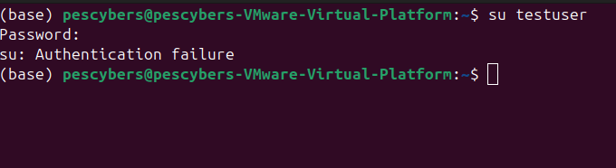
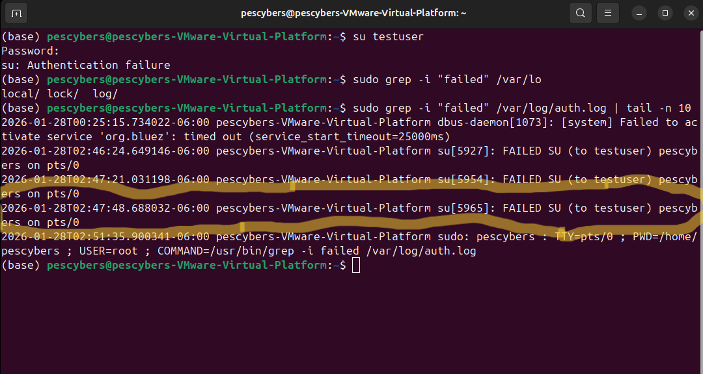
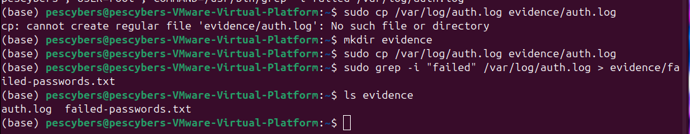
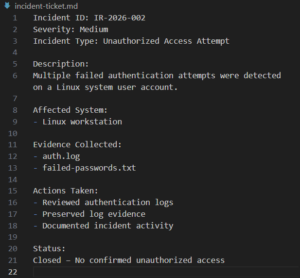

# PineRidge Services – Incident Response & Evidence Documentation Lab

## Overview
This lab simulates a real-world incident response scenario involving suspicious
authentication activity on a Linux system. The focus is on detection, evidence
preservation, documentation, and post-incident analysis rather than exploitation
or offensive security techniques.

The lab demonstrates how a security analyst or intern would responsibly handle
authentication-related incidents in a regulated or enterprise environment.

---

## Scenario
PineRidge Services, a mid-sized organization, identified repeated failed login
attempts on a Linux user account. While no confirmed breach occurred, the activity
raised concerns about potential unauthorized access attempts.

The security team was tasked with investigating the event, preserving evidence,
documenting actions taken, and recommending preventative controls.

---

## Objectives
- Detect suspicious authentication activity
- Collect and preserve relevant system logs as evidence
- Document the incident in a structured and auditable manner
- Build an incident timeline
- Conduct a post-incident review focused on prevention

---

## Tools & Environment
- Ubuntu Linux (Virtual Machine)
- System authentication logs (`/var/log/auth.log`)
- Terminal utilities (`grep`, `cp`)
- Markdown documentation
- Git & GitHub for version control

---

## Incident Summary
A controlled authentication failure was generated on a dedicated test account to
simulate suspicious login behavior. Authentication logs were reviewed to identify
failed login attempts, and relevant evidence was preserved for analysis.

The incident was documented through an incident ticket, a timeline of events,
and a post-incident review outlining corrective and preventative actions.

No successful unauthorized access was identified.

---

## Evidence (Screenshots)

### Authentication Failure Event
This screenshot shows a controlled authentication failure generated on a test
account to simulate suspicious login activity.

---

### Detection of Failed Login Attempts
This screenshot shows failed authentication attempts identified through system
authentication logs.

---

### Evidence Preservation
This screenshot confirms that relevant authentication evidence was preserved in a
dedicated evidence directory.

---

### Incident Documentation
This screenshot shows the completed incident ticket documenting the event, actions
taken, and resolution.

---

## Evidence Handling Note
Authentication evidence in this repository is intentionally curated. Full system
logs were preserved during investigation but excluded from this repository to
reduce noise and protect system-level information.

Relevant failed authentication events were extracted into `failed-passwords.txt`,
with screenshots included to support verification.

---

## Key Security Principles Demonstrated
- Authentication logging and monitoring
- Evidence preservation and integrity
- Incident documentation and audit readiness
- Least privilege and access control
- Continuous improvement through post-incident review

---

## Outcome
This lab demonstrates a complete incident response workflow suitable for entry-level
or intern security roles, emphasizing professionalism, documentation quality, and
real-world applicability across industries.
